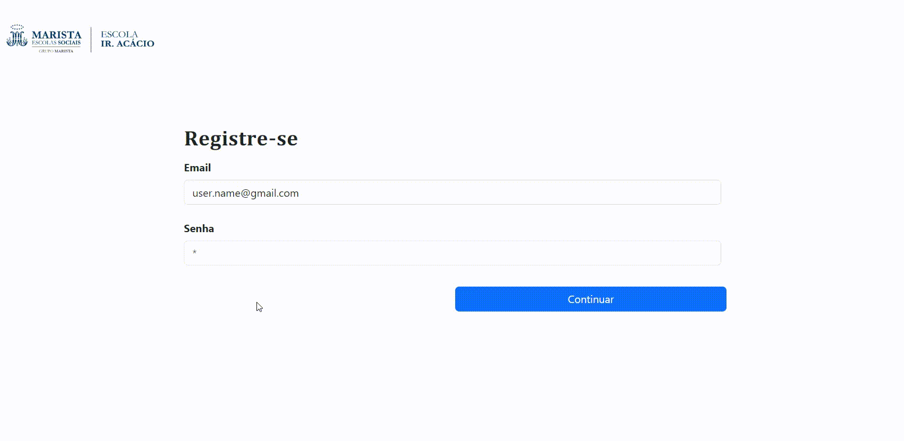

# Login   
>Construção de Tela de login a partir dos modelos existentes no [bootstrap 5](https://getbootstrap.com/).
#

## Descrição:
Trabalho avaliativo de criação de formulário que simula uma tela de login, utilizado em vários Ecommerces.

## Objetivos:

* Utilizar o bootstrap 5;
* utilizar os seguintes campos:
>1. Email;
>2. Senha;
>3. Botão (Acessar).
* Adicionar o link contido na aba (Pages).
#
## Tags HTML5:
| Elementos | Atributos |
| --- | --- |
| ``<*form*>`` - formulário | *input* - Dados requisitados
| ``<*label*>`` - Rótulo | *type* - Tipos de dados(password, email e submit)
| ``<*button*>`` - Botão | *id* - Indentificador
| ``<*div*>`` - Agrupa os conteúdos | *placeholder* - Legenda os campos de dados

<h2 align = center>Tecnologias:</h2>  

## Desenvolvedor
 
|   <a href="https://github.com/ESChrystian">Chrystian Almeida Silva</a> |
| --- |
#
### Fontes utilizadas:
* Imagem representativa Marista: [*Programa Impulso*](http://programaimpulso.org.br/osc/marista-escola-social-ir-acacio/)

